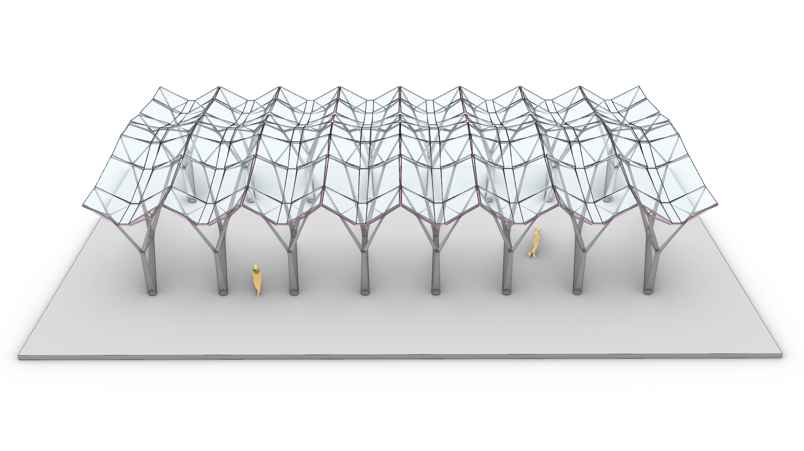

# Constrained form-finding of tension-compression structures using automatic differentiation



Paper pre-print: https://arxiv.org/abs/2111.02607

This repository contains data and code that supports the experiments presented in the paper "Constrained form-finding of tension-compression structures using automatic differentiation", submitted to the journal of [Computer-Aided Design](https://www.sciencedirect.com/journal/computer-aided-design) in 2022.

The code used to model the structures described therein is organized in three folders that match the three experimental sections of the paper:

1. Section 3: Two-segment compression strut, stored in``/extensions``
2. Section 4: Tensegrity wheel, tree canopy and bridge, saved in ``/numerical_validation``
3. Section 5: Spiral staircase, stored in ``/case_study``

The code in this repository runs in three different environments.
The Python script in the folder ``/case_study`` sections 3 is executed from a command line interface.
The [jupyter notebooks](https://jupyter.org/) in the folder ``/numerical_validation`` can be executed locally or remotely using [Google Colab](https://research.google.com/colaboratory/).
The file in ``/case_study`` only works in grasshopper for [Rhino3D](https://www.rhino3d.com/). 

Regardless of the file or the environment, all the files require a valid installation of ``compas_cem`` **version ``0.6.1``** to work.

If you are confortable with python, you can install this version of ``compas_cem`` with a one-liner:

``` python
pip install compas-cem==0.6.1
```

Otherwise, please follow the instructions listed [in this website](https://arpastrana.github.io/compas_cem/latest/installation.html) for more detailed instructions on how to install ``compas_cem`` according to your operating system.

If you have a question or you find a bug in the files, please reach out to arpastrana at princeton dot edu.
